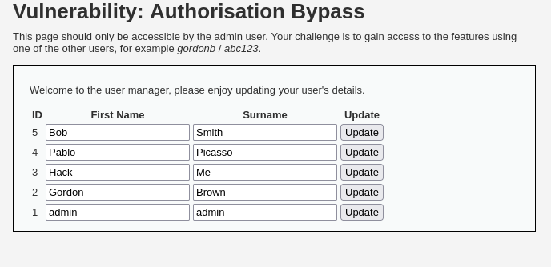
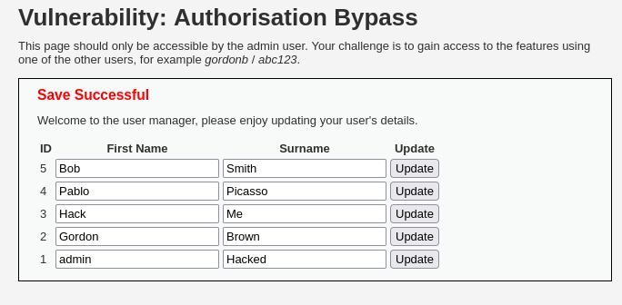
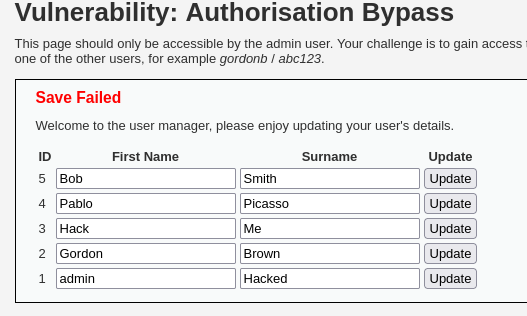

# DVWA 실습 - Authorisation Bypass

## 실습 목적
DVWA의 Low 레벨 환경에서 Authorisation Bypass 취약점을 확인하고, 일반 사용자가 관리자 계정 정보를 무단으로 수정하는 공격을 재현.

## 공격 시도 

id가 gordonb 인 일반 사용자로 로그인 후 admin 계정의 정보를 수정을 시도한다.

admin계정의 surname을 `Hacked`로 변경 후 Update 버튼을 클릭하여 서버에 요청을 보낸다. 

## 결과

서버가 권한 검증 없이 요청을 처리해서 일반 사용자가 admin 정보를 변경할 수 있었다. 위 사진과 같이 admin의 surname이 `Hacked`로 변경되었다. 

## 노트
Authorisation Bypass 취약점은 서버의 로직 결함 때문에 발생한다. 

서버가 요청 처리시 로그인된 사용자 ID와 요청 대상 ID를 비교하지 않고 무조건 수행해서 문제가 발생했다.

## 대응 코드 예시
수정된 PHP 코드 예시는 `../modified-code/Auth Bypass.php`에 있음

대응은 정보 수정 요청한 사용자와 현재 로그인한 사용자가 일치하는지 `if($login_id == $target_id)` 조건으로 검증했다.

## 대응 결과

위 사진과 같이 일반 사용자가 admin 계정 정보 수정 시도시, Save Failed 라고 나오면서 수정을 못하게 한다.