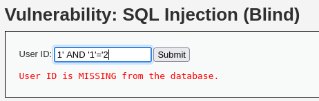

# DVWA 실습 - SQL Injection (Blind)

## 실습 목적
DVWA의 Low 레벨 환경에서 SQL Injection(Blind) 취약점을 확인하고, 직접적인 데이터베이스 출력 없이 참과 거짓의 차이를 이용해 데이터베이스 정보를 탈취하는 과정을 재현한다.

## 공격 시도
SQLi 공격 시도가 가능한지 다음과 같이 판단한다.

위 사진은 사용자 ID 입력칸에 `1' AND '1'='1` 시도 -> 조건이 참이 되어 존재하는 사용자로 판단되었고,
 

위 사진은 사용자 ID 입력칸에 `1' AND '1'='2` 시도 -> 조건이 거짓이라는 결과가 나왔으므로 입력한 SQL 구문의 논리적 평가 결과에 따라 반응이 다르므로 Blind SQL Injection 공격 가능성이 있다.

이제 참/거짓 반응을 이용해 데이터베이스 정보를 한글자씩 알아내는 공격을 시도한다.

이번 실습에서는 

`1' AND SUBSTRING(@@version,1,1)>'4' -- `
`1' AND SUBSTRING(@@version,1,1)='1' -- `

위 2개 입력으로 데이터베이스 앞자리 정보를 알아내기 위해 실행해 보았다.

## 결과

위 사진처럼 `1' AND SUBSTRING(@@version,1,1)>'4' -- ` 실행시 거짓이 나왔고, DB 버전 첫 글자가 4이상이 아니란 것을 알 수 있다.

위 사진처럼 `1' AND SUBSTRING(@@version,1,1)='1' -- ` 실행시 참이 나왔고, DB 버전 첫 글자가 1임을 알 수 있다.

이런 공격들은 자동화 도구를 사용하면 더 빠르고 효울적으로 공격할 수 있다.

## 노트
Blind SQL Injection은 직접적인 결과는 보이지 않지만 간접적으로 알 수 있다. 

여기에 자동화 도구까지 같이 사용한다면 위협적이다. 

예를 들어 공격자가 응답 속도 및 결과 존재에 따라 데이터베이스 내부 정보를 한 글자씩 추출이 가능하고, 계정 정보, 테이블 구조 등 여러 정보가 탈취 가능하다.

## 대응 코드 예시
수정된 PHP 코드 예시는 `../modified-code/Blind SQL Injection.php`에 있음

우선 prepare()을 이용해 SQL쿼리문과 사용자 입력값을 분리하고, 
bind_param()을 이용해 사용자 입력값을 string이라고 명시함으로써 Blind SQL injection을 차단했다.

## 대응 결과

위 사진에서 볼 수 있듯이 `1' AND '1'='1` 을 입력하면 전체가 문자열로 받아들여져 결과가 거짓이 되었을을 확인 할 수 있다 (기존은 참이었음).

더 이상 참/거짓에 따른 응답 차이를 유도할 수 없음을 확인했다.
