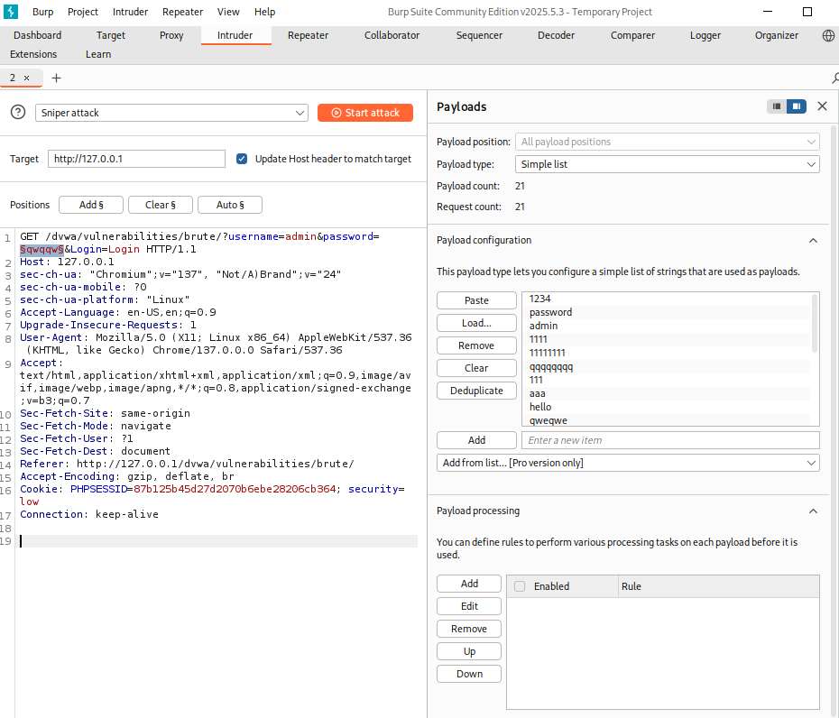
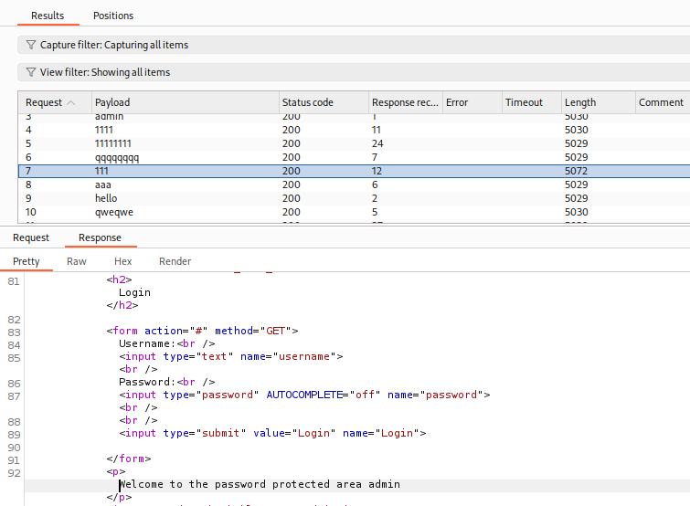
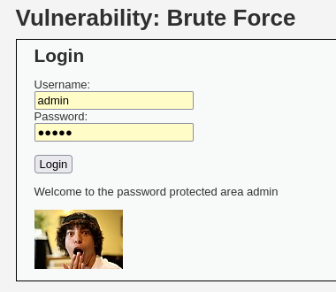
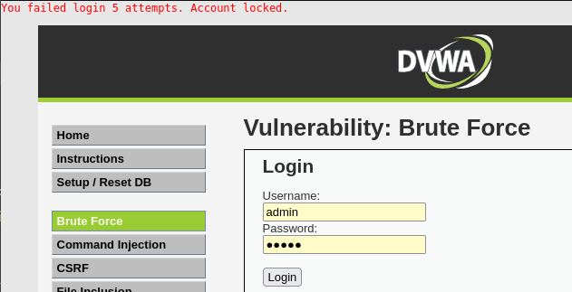
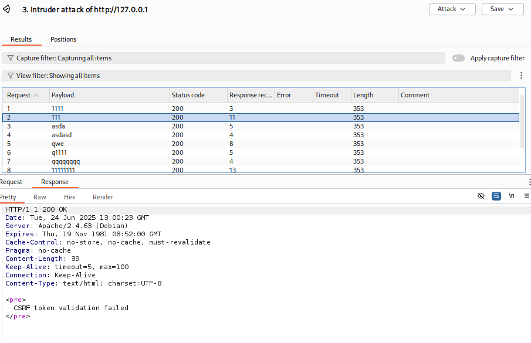

# DVWA 실습 - Brute Force

## 실습 목적
DVWA의 Low 레벨 환경에서 Brute Force 취약점을 확인하고, 사용자 이름은 고정하고 비밀번호를 무작위로 대입하여 특정 계정의 비밀번호를 알아내는 공격 시나리오를 재현.

## 공격 시도
공격자 입장에서 특정 사용자의 비밀번호를 알아내기 위해 username은l admin으로 고정하고 password 값을 무작위로 대입했다. 

공격 도구로는 Burp Suite의 Intruder 기능을 사용했다.

Burp Suite를 프록시로 설정 후, DVWA Brute Force에서 임의의 username과 password 입력후 요청을 가로챘다. 

가로챈 요청을 Burp Suite의 intruder로 보냈고, 

위 사진과 같이 password 파라미터는 공격 대상으로 페이로드 마커를 설정했고, 비밀번호 무작위 대입을 위한 워드리스트를 생성했다.

그 후, 버튼을 눌러 Brute Force 공격을 시도했다.

## 결과
공격이 진행되고 다음과 같이 Burp Suite Intruder의 응답을 분석했다.

위 사진과 같이 7번 요청만 length 길이가 확연히 다른것을 확인할 수 있다. 

다른 요청들은 5029~5030이지만 7번만 5072로, 로그인에 성공했음을 의미한다. 

위 사진의 아랫부분 7번 response를 확인한 결과 `Welcome to the password protected area domain`으로 로그인을 성공했음을 알 수있다.

위 사진처럼 해당 비밀번호로 로그인이 잘 됨을 알 수 있다.

## 노트
Brute Force는 올바른 사용자 이름과 비밀번호 조합을 찾을때까지 모든 조합을 시도하는 공격 기법이다. 이 공격은 자동화된 도구를 사용하여 수많은 로그인 시도를 할 수 있다.

공격자는 Brute Force로 계정 탈취 등 여러 피해를 입힐 수 있다.

## 대응 코드 예시
수정된 PHP 코드 예시는 `../modified-code/Brute Force.php`에 있음

DVWA low단계에서의 위 코드 수정으로 index.php는 아래 코드를 추가하여 CSRF 토큰을 폼에 포함시켰다.  

if($vulnerabilityFile=='low.php'){
        $page['body'] .= '<input type="hidden" name="csrf_token" value="'. htmlspecialchars($csrf_token) . '" />';
} 

5회 이상 실패시 계정 잠금되어 더 시도 못하게 막았고, CSRF 토큰을 추가하여 공격자가 자동화된 공격 (Burp Suite 등)을 막게 했다.

## 대응 결과

위 이미지 처럼 5회 이상으로 로그인 실패시 해당 메시지가 뜨게 하고, 로그인도 더 못하게 막았다.

위 이미지 처럼 CSRF 토큰 추가로 Burp Suite Intruder과 같은 도구로 무작위 대입 공격을 시도할 경우, Intruder 공격은 최초에 가로챈 요청으로 보내는 방식이다.

그러나 서버는 매 요청마다 유효한 CSRF토큰이 있는지 검증하는데, 공격자가 보낸 2번째 이후부터의 모든 요청은 유효한 토큰이 아니기에 위 이미지 처럼 CSRF token validation failed 라고 나온다.