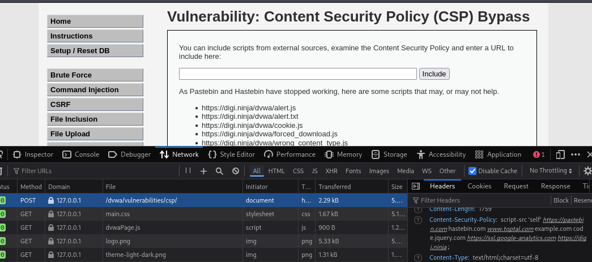
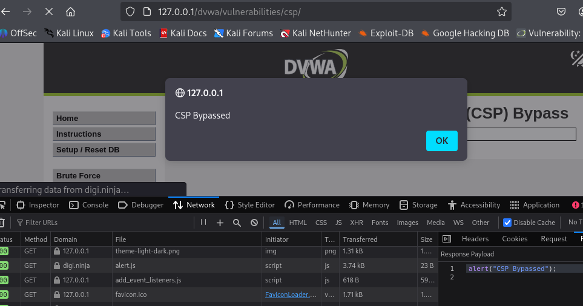
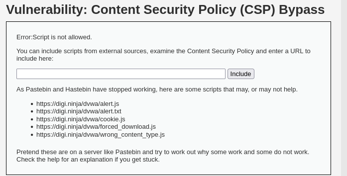

# DVWA 실습 - Content Security Policy Bypass

## 실습 목적
DVWA의 Low 레벨 환경에서 CSP Bypass 취약점을 확인하고, 공격자가 화이트리스트에 등록된 도메인을 악용하여 CSP를 우회하고 XSS공격을 수행하는 과정을 재현한다.

## 공격 시도 

공격자는 브라우저의 개발자 도구의 네트워크 탭을 열어 페이지 응답 헤더의 Content-Security-Policy를 확인하고, 위 사진과 같이 `script-src`에 있는 도메인을 확인한다.

`digi.ninja` 도메인이 화이트리스트에 포함된 것을 확인하고, 문제에서 제공하는 `https://digi.ninja/dvwa/alert.js`를 입력창에 넣는다.

## 결과
Include 버튼을 클릭하면, 브라우저는 `https://digi.ninja/dvwa/alert.js` 스크립트를 로드하고 실행한다. CSP의 srcipt-src 정책에 의해 허용되었기 때문이다.

위 사진과 같이 경고창이 실행되며, 공격자가 CSP 정책을 우회해 XSS 공격이 성공했다.

## 노트
CSP는 강력한 보안 정책이지만, 사용자가 콘텐츠를 자유롭게 올릴 수 있는 도메인을 무분별하게 추가하면, 해당 도메인이 XSS 공격으로 이어질 수 있다.

## 대응 코드 예시
수정된 PHP 코드 예시는 `../modified-code/CSP_Bypass.php`에 있음

화이트리스트를 만들어 입력 단계에서 허용된 스크립트인지 아닌지 검사를 하였다.

## 대응 결과

위 사진은 화이트리스트를 이용하여 `https://digi.ninja/dvwa/alert.js`스크립트를 차단한 결과이다. Error:Script is not allowed. 라는 문자열과 함께 alert가 뜨지 않는 모습을 볼 수 있다.