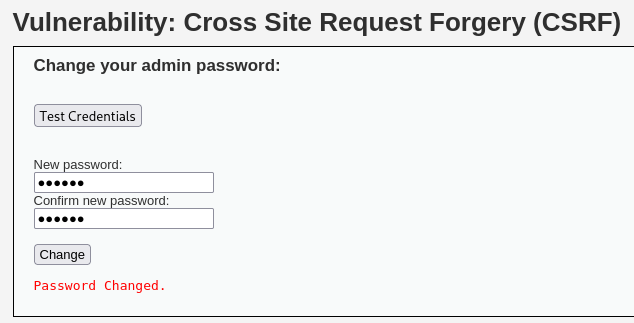
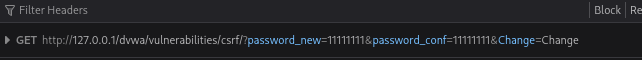
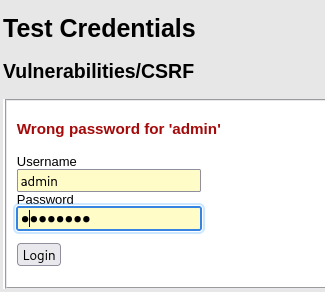
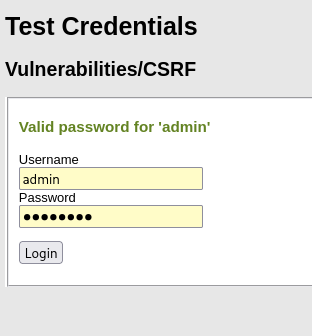
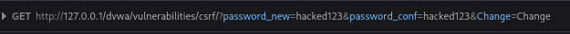
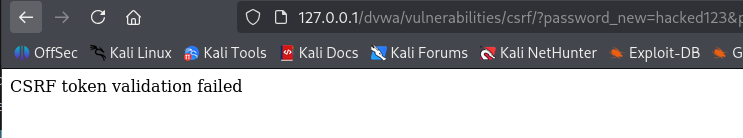

# DVWA 실습 - Cross Site Request Forgery (CSRF)

## 실습 목적
DVWA의 Low 레벨 환경에서 Cross Site Request Forgery (CSRF) 취약점을 확인하고, 공격자가 사용자 몰래 비밀번호 변경 요청을 보내서 해당 사용자 계정을 탈취하는 상황을 재현한다.

## 공격 시도
사용자가 DVWA에서 admin 계정으로 로그인한 상태에서, 악성링크를 사용자가 클릭한 후 공격시도가 이루어진다.

공격자 입장에서 

다른 사용자의 비밀번호를 바꾸기 위해 정보를 입수. 

위 요청 파라미터를 이용해 악성 웹페이지를 통해 요청 보냄

공격자 html 코드 예시는 `../modified-code/CSRF_Attack.html`에 있음

실습에서 사용자가 로그인 한 상태에서 공격자 html을 여는 방식으로 진행했다.

## 결과
DVWA에 admin으로 로그인된 상태에서 CSRF_Attack.html을 통해 요청을 보낸 결과, admin 계정의 비밀번호가 hacked123 으로 변경되었다. 

아래 사진에서 위는 사용자가 기존 비밀번호로 로그인 했을 때, 아래는 사용자가 hacked123으로 로그인 시도 했을 때이다.

아래 사진은 비밀번호를 hacked123으로 바꾸는 요청 파라미터이다.

## 노트
Cross Site Request Forgery(CSRF)는 사용자가 의도하지 않은 요청을 보내도록 유도하는 공격이다. 
공격자는 피해자의 정보를 이용해 여러 피해를 입힐 수 있다.

CSRF는 브라우저가 사용자의 세션 쿠키를 자동으로 전송하는 동작을 악용한 공격이며, 정상적인 사용자 행위처럼 오인하게 만드는 공격이다.

## 대응 코드 예시
수정된 PHP 코드 예시는 `../modified-code/CSRF_Protected.php`에 있음

DVWA low단계에서의 위 코드 수정으로 index.php는 아래 코드를 추가하여 CSRF 토큰을 폼에 포함시켰다.  

if($vulnerabilityFile=='low.php'){
        $page['body'] .= '<input type="hidden" name="csrf_token" value="'. htmlspecialchars($csrf_token) . '" />';
} 

CSRF_Protected.php에서는 다음과 같은 방식으로 대응했다. 

1. 세션에서 CSRF 토큰을 생성 (random_bytes())

2. HTML 폼에 hidden 필드로 포함

3. 사용자가 요청을 보낼 때 CSRF 토큰도 함께 전송

4. 서버는 hash_equals()를 이용해 세션의 토큰과 요청에 담긴 토큰을 비교

5. 일치하지 않으면 요청 차단

## 대응 결과

CSRF 토큰이 적용된 상태에서 공격자가 CSRF_Attack.html을 통해 공격을 시도하면, 위 사진처럼 서버가 유효한 토큰이 없음을 확인하고 요청을 거부한다.

