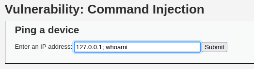

# DVWA 실습 - Command Injection

## 실습 목적
DVWA의 Low 레벨 환경에서 Command Injection 취약점을 확인하고, 공격을 통해 웹 서버 내부 명령어 실행에 성공한다.

## 공격 시도
입력 필드에 `127.0.0.1; whoami` 입력

서버가 입력값을 필터링하지 않고 명령어로 실행

## 결과
`whoami` 결과: `www-data`

웹 서버 권한으로 명령어 실행 가능

내부 폴더 탐색 가능 (`ls`, `cat`, 등)

## 노트
사용자 입력을 `shell_exec()` 등에 직접 넘기는 것은 위험함

명령어 실행시 입력값을 검증하는 것이 필요

## 대응 코드 예시
수정된 PHP 코드 예시는 `../modified-code/Command Injection.php`에 있음

escapeshellcmd()를 이용해 특수문자를 escape해서 명령어 주입을 막는다.

## 대응 결과

위 사진처럼 명령어 주입을 시도해도 아무것도 뜨지 않음

쉘은 `127.0.0.1\; whoami` 이렇게 문자열로 받아들여서 명령어 주입을 차단한다.
