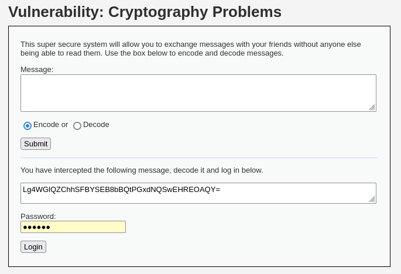
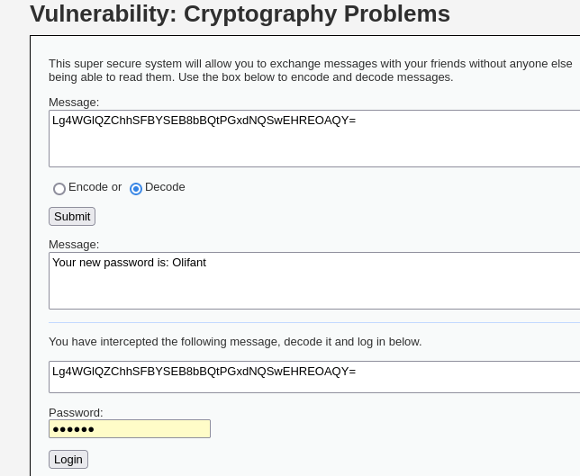
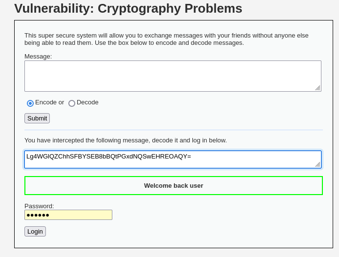
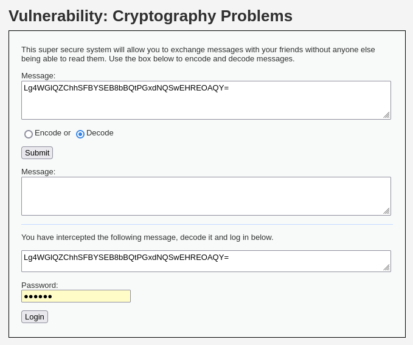

# DVWA 실습 - Cryptography

## 실습 목적
DVWA의 Low 레벨 환경에서 Cryptography 취약점을 확인하고, 
키를 사용하여 암호를 해독한 후 시스템에 로그인하는 과정을 재현한다.

## 공격 시도 

위 사진과 같이 메시지를 암호화/복호화하는 기능과 탈취된 메시지와 로그인 폼이 있다.

공격자는 주어진 암호화된 메시지를 웹 페이지의 복호화 기능에 넣고 해독을 시도한다. 

## 결과

위 사진과 같이 메시지를 복호화해서 새로운 패스워드가 `Olifant` 임을 알아내고,  

위 사진과 같이 공격자가 Welcome back user 메시지와 함께 로그인을 성공함을 알 수 있다.

## 노트
Cryptography 문제는 내부 구현을 숨기는 것만으로 보안을 달성할 수 없다는 것을 보여준다. 

입력된 값과 키를 XOR 연산해서 암호화를 진행하고, 키 `wachtwoord`도 소스코드에 노출되어 있어 공격자가 손쉽게 해독이 가능하다.

## 대응 코드 예시
수정된 PHP 코드 예시는 `../modified-code/Cryptography.php`에 있음

키 관리를 key.php로 분리를 하였고, 
key.php는 `<?php return '암호키'; ?>` 와 같은 형태로 저장했다. 

암호화를 AES-256-GCM을 사용하여 이전 코드 XOR에서 보안을 강화하였다. GCM을 사용하여 데이터의 무결성도 확보하였다.

## 대응 결과

위 스크린샷처럼 해당 메시지를 복호화헤보려 해도 복호화 되지 않는다.  

키가 더 이상 소스코드에 노출이 되지 않고, 공격자가 암호화된 데이터를 탈취하더라도, 이를 복호화하는 것은 사실상 불가능하다.
