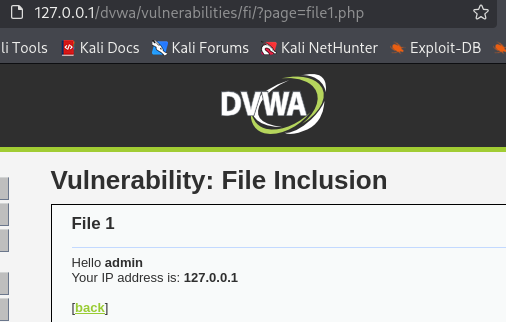

# DVWA 실습 - File Inclusion

## 실습 목적
DVWA의 Low 레벨 환경에서 File Inclusion 취약점을 확인하고, 공격을 통해 웹 서버 내부의 보안 취약성을 확인한다.

## 공격 시도

`?page=파일명` 파라미터 구조와 내용을 보고 내부적으로 include 같은 걸 쓰는 구조구나 파악.

입력값으로 파일 경로 조작 시도 (`http://127.0.0.1/dvwa/vulnerabilities/fi/?page=../../../../../../etc/passwd`), 시스템 파일에 접근 시도함.

## 결과
`../../../../../../etc/passwd` 경로를 통해 `/etc/passwd` 파일의 내용이 웹브라우저 화면에 성공적으로 출력됨.

파일에는 시스템 사용자 계정 정보가 포함되어 있었음, 공격자가 구조 파악 및 추가 공격에 이용 할 수 있음.

## 노트
웹 서버가 사용자 입력에 대해 적절한 검증 없이 파일을 포함하는 것은 위험.

## 대응 코드 예시
수정된 PHP 코드 예시는 `../modified-code/File Inclusion.php`에 있음

basename()으로 디렉토리 경로를 제거해 공격을 1차적으로 막고, 

허용된 파일(whitelist)만 쿼리로 받기 가능하게 코드를 수정했다.

그 외 요청은 모두 차단한다.

## 대응 결과

위 사진처럼 허용되지 않은 쿼리는 'Error: Invalid file requested.' 라는 메시지를 출력하며 요청을 차단.

위 사진과 같이 `include.php, file1.php, file2.php, file3.php` 만 쿼리로 허용한다.
