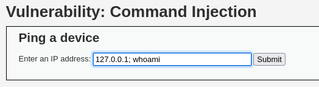

# DVWA 실습 - File Inclusion

## 실습 목적
DVWA의 Low 레벨 환경에서 File Inclusion 취약점을 확인하고, 공격을 통해 웹 서버 내부의 보안 취약성을 확인한다.

## 공격 시도

`?page=파일명` 파라미터 구조와 내용을 보고 내부적으로 include 같은 걸 쓰는 구조구나 파악
입력값으로 파일 경로 조작 시도 (`http://127.0.0.1/dvwa/vulnerabilities/fi/?page=../../../../../../etc/passwd`)

## 결과
/etc/passwd 파일 내용 화면에 출력

## 노트
사용자 입력을 `shell_exec()` 등에 직접 넘기는 것은 위험함
명령어 실행시 입력값을 검증하는 것이 필요

## 대응 코드 예시
수정된 PHP 코드 예시는 `../modified-code/.php`에 있음
escapeshellcmd()를 이용해 특수문자를 escape해서 명령어 주입을 막는다.

## 대응 결과

위 사진처럼 명령어 주입을 시도해도 아무것도 뜨지 않음
쉘은 `127.0.0.1\; whoami` 이렇게 문자열로 받아들여서 명령어 주입을 차단한다.
