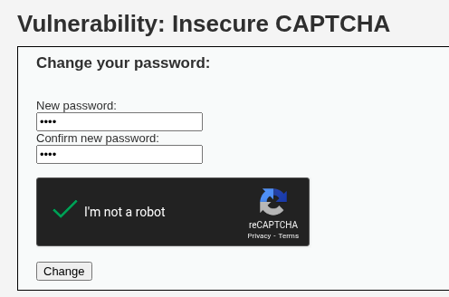
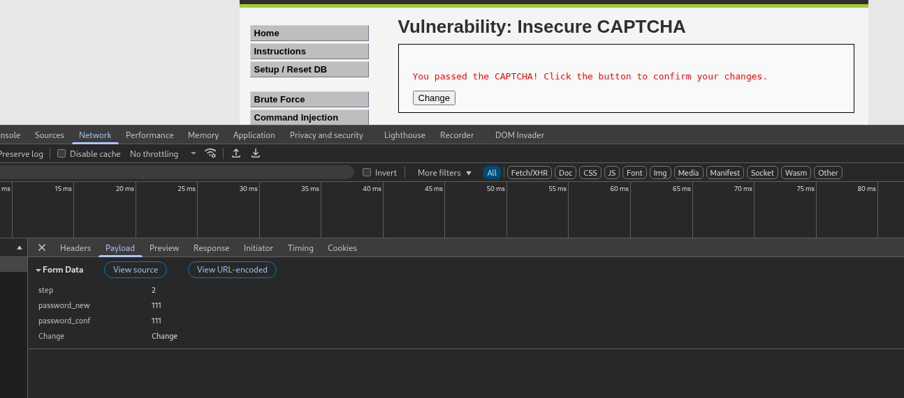
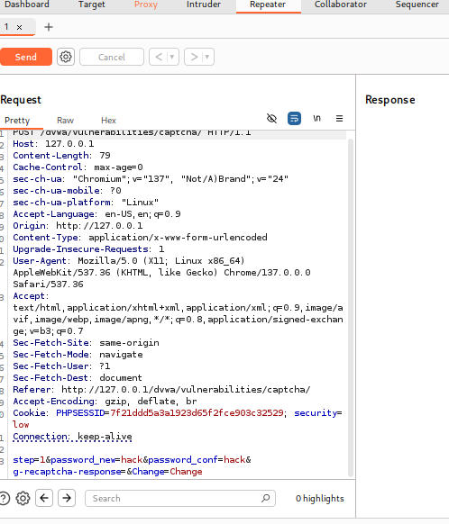
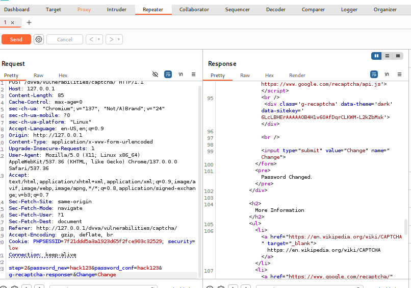
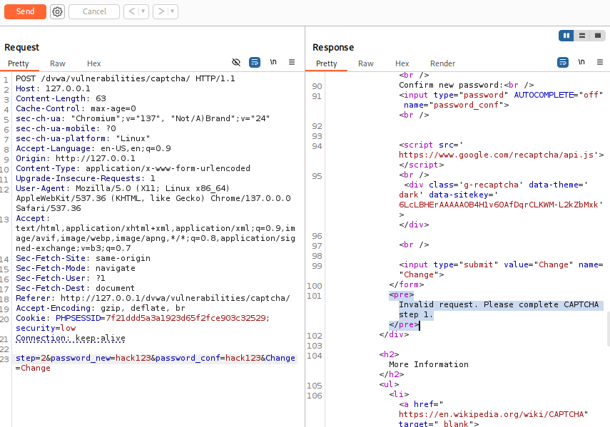

# DVWA 실습 - Insecure CAPTCHA

## 실습 목적
DVWA의 Low 레벨 환경에서 Insecure CAPTCHA 취약점을 확인하고, 공격자가 인증과정을 우회하여 서버에 요청을 보내는 공격을 재현한다.

## 공격 전 정보 수집

위 사진처럼 new,confirm password 입력창에, CAPTHA 체크를 하는 인터페이스이다.

위 사진과 같이 CAPTCHA 체크 후 정상적으로 폼 제출을 하면 페이로드로 g-recaptcha-response 필드가 서버로 보내진다.
이때 step값은 1로, CAPTCHA 인증을 한다.

그 후, 새로운 폼을 생성해 캡처가 통과 됐다고 메시지가 나오고 change 버튼이 나온다. step이 2이고, 서버는 `CAPTCHA 검증 없이` 패스워드와 새로운 패스워드가 일치하는지만 확인한다. 

## 공격 시도 
취약점은 step=2에서 CAPTCHA 통과되었는지 확인이 없다는 것이다. 즉, 공격자는 step=1을 건너뛰고, step2에서 암호 변경 요청을 할 것이다.

공격자는 DVWA 페이지에서 새 암호를 입력하고 CAPTCHA를 풀지 않은 채 change를 누르고, 위 사진과 같이 
위 사진과 같이 Burp Suite에서 해당 요청을 가로채고, Repeater로 보냈다.

사진에서 볼 수 있듯이 step=1이고, g-recaptcha-response는 빈 문자열이고, CAPTCHA가 틀렸다는 응답을 받는다.

공격자는 이 Repeater 탭에서 step1을 step2의 request로 만들 것이다. step을 1->2로 변경하고,  g-recaptcha-response 파라미터는 삭제했다.

그 후, send 눌러 서버에 전송했다.

## 결과

서버는 step=2 요청을 받고 CAPTCHA 검증 없이 암호를 변경한다. 위 사진에서 볼 수 있듯이 Burp Suite의 응답창에서 `Password Changed` 메시지가 반환되어 공격이 성공함을 알 수 있다.

공격자는 CAPTCHA 인증을 거치지 않고, step값을 2로 조작함으로서 인증 절차를 우회하고 서버에 직접 비밀번호 변경 요청을 보낼 수 있었다.

## 노트
Insecure CAPTCHA 취약점은 서버의 구현 로직의 결함 때문에 생긴 일이다. 

2단계 실행시 1단게가 완료되었는가에 대한 검증이 필요하다.

## 대응 코드 예시
수정된 PHP 코드 예시는 `../modified-code/Insecure CAPTCHA.php`에 있음

step=1에서 CAPTCHA와 암호 확인 완료시 세션변수 $_SESSION['captcha_passed'] = true; 를 저장한다. 

step2 시작할 때 captcha_passed가 true인지 확인하고 실행하고, step2가 끝나면 세션 변수를 삭제한다.

## 대응 결과

위 사진은 공격할 때와 마찬가지로 step=1 파라미터를 2로 강제 변경하여 공격시도 했지만, Invalid request. Please complete CAPTCHA step 1. 이라고 나오며 블락되었다.