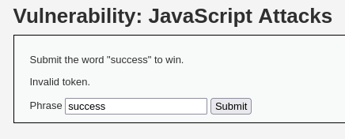
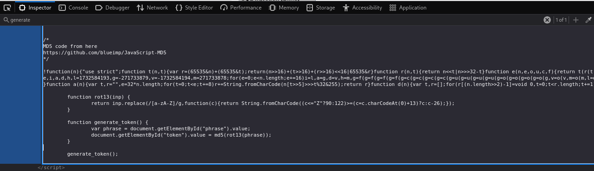
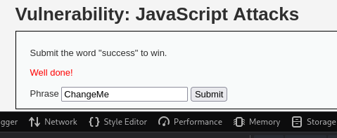

# DVWA 실습 - Java Script Attack

## 실습 목적
DVWA의 Low 레벨 환경에서 Java Script Attack 취약점을 확인하고, 클라이언트 측에서만 검증을 수행하는 구조의 문제점으로 공격자가 이를 우회할 수 있는 상황을 재현한다.

## 공격 전 정보 수집

위 사진처럼 Phrase 입력창에 success라 입력했다.

하지만 Invalid token. 오류가 발생.

공격자는 token이 만들어지는 과정 및 검증을 분석.

위 사진과 같이 `<script>` 태그 안에 있는 md5, rot13, generate_token을 보고 마지막 줄 generate_token();을 확인.

즉, 페이지가 열리자마자 `generate_token();`이 실행되고 md(rot13("")); - 빈 문자열에 대한 토큰이 생성된 후, token 필드에 저장된다.

따라서 success를 입력하고 폼을 제출할 때, 빈 문자열에 대한 토큰을 보내니까, 실패한 것이었다.

## 공격 시도 
success 단어를 입력창에 넣어둔 상태에서 `generate_token();` 함수를 수동으로 실행해본다.
즉, console 입력창에 `generate_token();`을 실행한다.

## 결과

`generate_token();`이 실행된 후 md(rot13("success")) 값이 token필드로 들어가고, 위 사진과 같이 Well done! 이 출력되었다.

## 노트
JavaScript Attack은 보안 검증 로직을 클라이언트 측에서만 처리할 경우 발생할 수 있는 취약점을 보여준다.

JavaScript는 누구나 열람 및 수정이 가능하므로, 보안 관련 로직은 클라이언트에만 두는 것은 위험하다. 이로 인해 공격자는 쉽게 로직 분석후 우회가 가능하다.

## 대응 코드 예시
수정된 PHP 코드 예시는 `../modified-code/JavaScript.php`에 있음

CSRF방어와 동일하다. `bin2hex(random_bytes(16));`을 이용하여 클라이언트와 서버간 비교를 hash_equals()로 비교한다.

## 대응 결과

위 사진은 서버에서 생성된 실제 토큰 예시이다.

서버에서도 토큰을 검증하므로, 클라이언트 쪽에서 임의로 토큰 값을 조정해도 해당 공격은 전부 막는다.