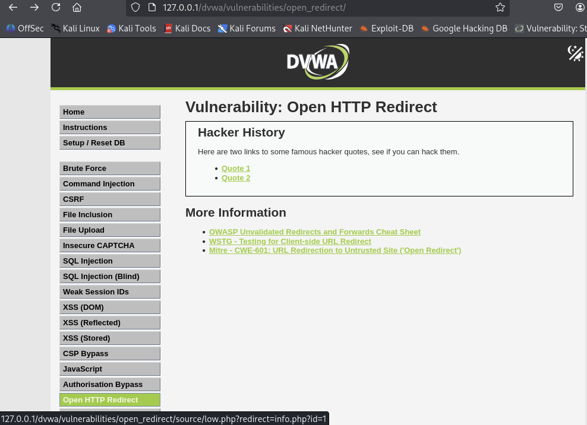
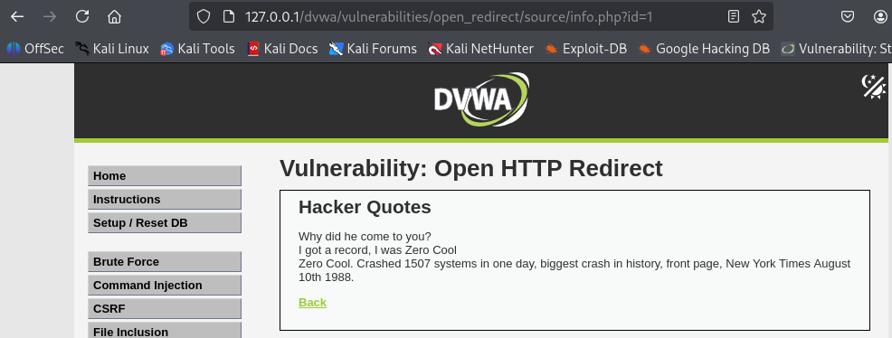
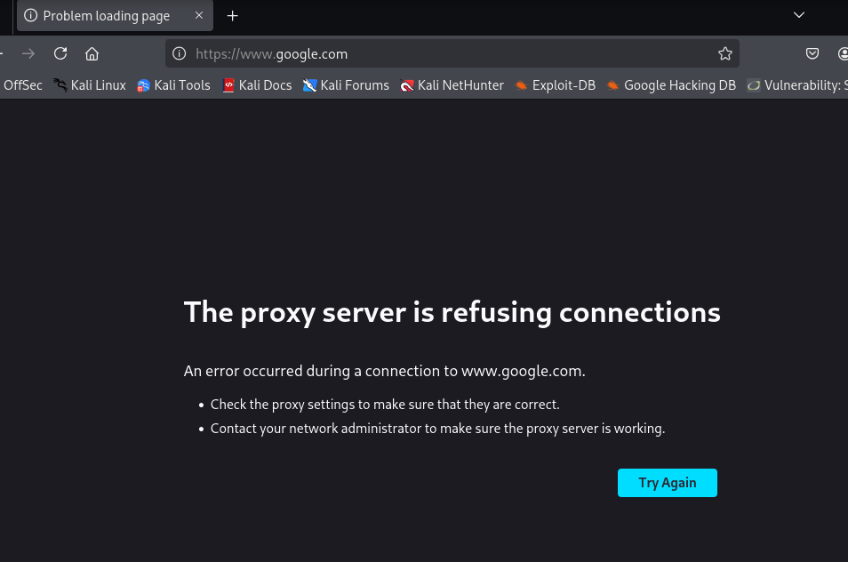
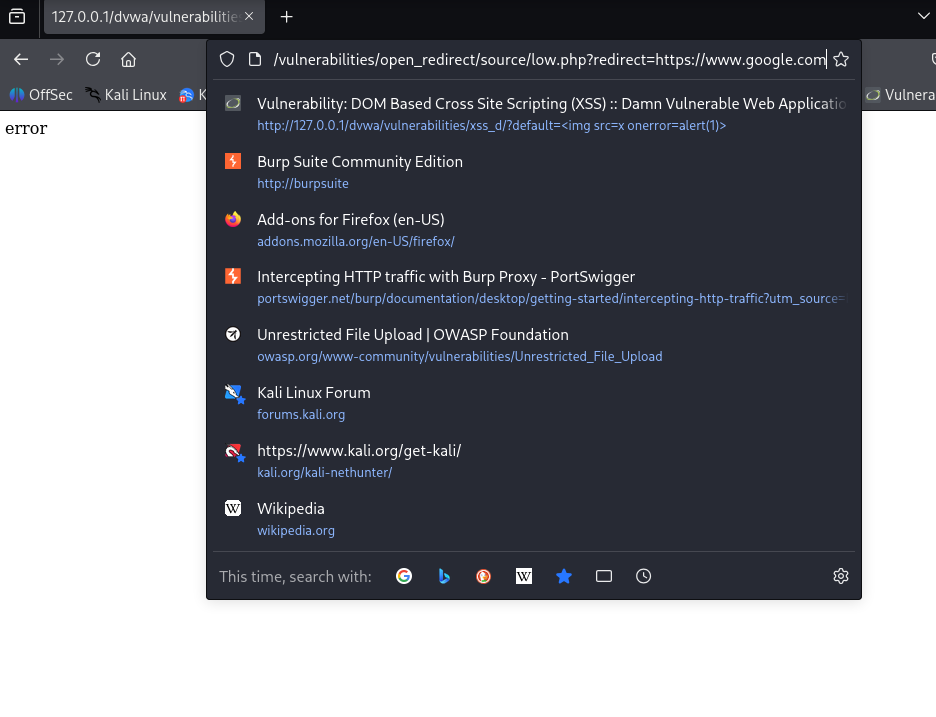

# DVWA 실습 - Open HTTP Redirect

## 실습 목적
DVWA의 Low 레벨 환경에서 Open HTTP Redirect 취약점을 확인하고, 공격자가 이 취약점을 이용해 사용자를 악성 사이트로 유도하는 공격을 재현한다.

## 공격 전 정보 수집

위 사진처럼 DVWA의 Open HTTP Redirect 페이지에 접속하면 2개의 링크가 보인다.

링크 위에 마우스를 올려보면 URL이 `127.0.0.1/dvwa/vulnerabilities/open_redirect/source/low.php?redirect=info.php?id=1` 다음과 같은 형식임을 알 수 있고, 

이 링크를 클릭하면 위 사진처럼 `info.php` 페이지로 정상적으로 리다이렉트 된다.

## 공격 시도 
공격자는 파라미터 값을 외부 URL ex.`https://www.google.com`로 변경한다.

`http://127.0.0.1/dvwa/vulnerabilities/open_redirect/source/low.php?redirect=https://www.google.com`

공격자는 이렇게 조작된 URL을 이메일이나 메신저를 통해 사용자에게 전송한다.

## 결과

위 사진과 같이 사용자가 조작된 링크를 클릭하면 DVWA 서버는 redirect 파라미터의 `https://www.google.com` 으로 즉시 리다이렉트 시킨다.

## 노트
Open Redirect 취약점은 사용자의 신뢰를 악용하여 피싱 성공률을 높일 수 있는 문제이다.

사용자는 정상적인 도메인을 보고 링크를 클릭했지만, 결과적으로 공격자가 만든 피싱 사이트로 접속하기 때문이다. 

## 대응 코드 예시
수정된 PHP 코드 예시는 `../modified-code/Open HTTP Redirect.php`에 있음

Whitelist를 이용해 허용된 URL목록만 리다이렉트 가능하게 코드를 변경하였다.

## 대응 결과

허용된 목록에 없는 외부 URL은 위 사진과 같이 error 라는 문자열과 함께 접근이 거부된다.
