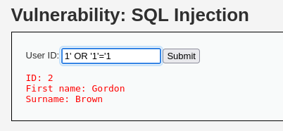
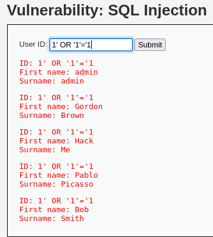
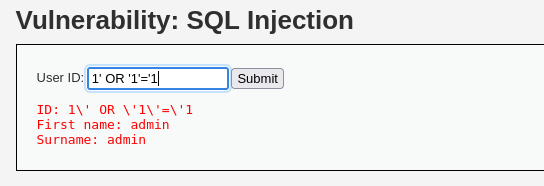

# DVWA 실습 - SQL Injection

## 실습 목적
DVWA의 Low 레벨 환경에서 SQL Injection 취약점을 확인하고, 사용자의 입력이 SQL 쿼리에 그대로 삽입되어 데이터 탈취가 가능한 상황을 재현한다.

## 공격 시도

위 사진과 같이 사용자 ID를 입력하고 조회 결과를 출력하는 인터페이스이다.

사용자 ID 입력칸에 `1' OR '1'='1` 시도

## 결과

위 사진처럼 모든 사용자 정보가 출력되며, 인증 없이도 내부 정보를 가져올 수 있다는 것을 확인했다.

Select문에서 Where절에 `user_id= '1' OR '1'='1';` 로 injection 됬다는 사실을 알 수 있다. 

OR 다음이 항상 true이므로 Where절이 true임에 따라 모든 사용자가 출력된다.

## 노트
SQL Injection은 사용자 입력값이 적절히 필터링되지 않고 SQL 문장에 직접 삽입되는 경우 발생한다.

공격자는 이를 통해 인증 우회, 테이블 삭제 등 여러가지 시도를 할 수 있다. 

## 대응 코드 예시
수정된 PHP 코드 예시는 `../modified-code/SQL Injection.php`에 있음

사용자 입력값에 대해 mysqli_real_escape_string()으로 escape 처리.

예를 들어, '는 \'로 변환되어 SQL입장 문자열의 일부로 인식함. 

## 대응 결과

위 사진처럼 공격 문자열 `1' OR '1'='1` 을 입력해도 쿼리가 안전하게 실행되어 모든 사용자가 출력되지 않고 올바른 결과만 나타남.
