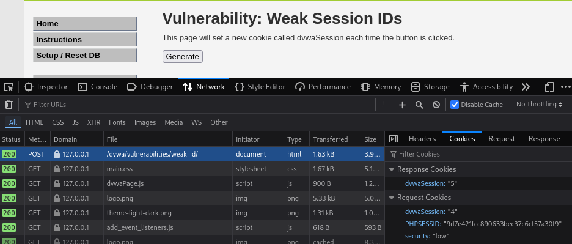
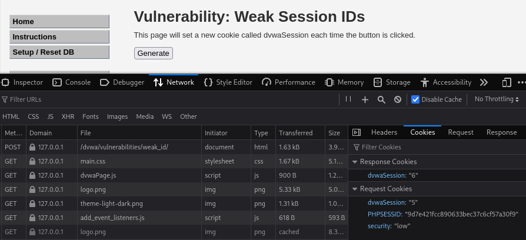
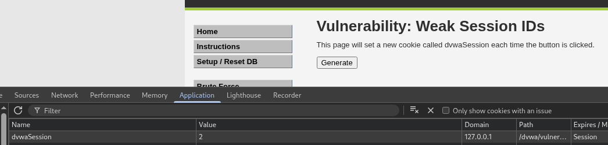
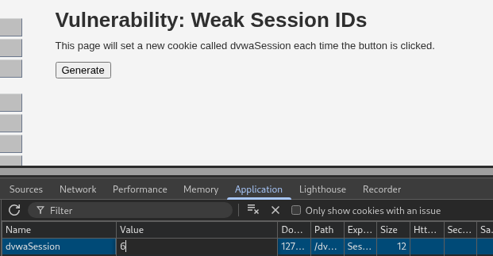
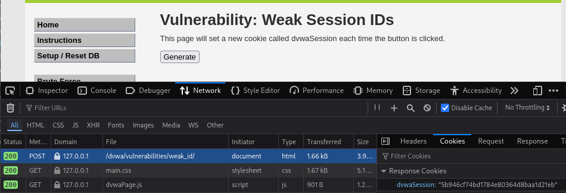

# DVWA 실습 - Weak Session IDs

## 실습 목적
DVWA의 Low 레벨 환경에서 Weak Session IDs 취약점을 확인하고, 공격자가 예측 가능한 세션 ID값을 통해 세션 탈취를 시도하는 것을 재현한다.

## 공격 시도

DVWA의 Weak Session IDs 페이지에서 Generate버튼을 누를 때마다 위의 사진과 같이 dvwaSession이라는 새로운 쿠키가 할당된다. 

이를 반복적으로 클릭하여 수집한 dvwaSession 값은 다음과 같았다.

dvwaSession=1
dvwaSession=2
dvwaSession=3
dvwaSession=4
...

위와 같이 dvwaSession 값은 단순히 숫자가 1씩 증가하는 방식으로 생성됨. 

현재 사용자는 Firefox 브라우저를 사용했고, dvwaSession은 6이다.

공격자는 Chrome 브라우저를 사용했고 (독립적 세션 위해)

DVWA의 Weak Session IDs 로 이동하여 위와 같이 dvwaSession의 쿠키 값 패턴 파악 후

쿠키를 수동으로 변경할 수 있다.

위 사진은 공격자가 세션 탈취 시도전의 dvwaSession 쿠키 값 상태(2)이다. 

## 결과

위 사진과 같이 공격자는 쿠키를 수동으로 변경이 가능하다 (2에서 6으로). 

만약 실제 어플리케이션의 로그인 세션 ID(PHPSESSID 같은 쿠키)가 dvwaSession처럼 예측 가능하게 생성된다면, 

공격자는 다른 활동중인 사용자의 세션 ID를 추측 및 자동화 도구도 사용이 가능하다.

그 후, 공격자는 세션 ID를 수동으로 변조하고, 다른 사용자의 계정에 로그인 하지 않아도 세션 탈취에 성공할 가능성이 높다.

## 노트
Weak Session ID에서 공격자가 실제 로그인 세션 ID가 예측 가능하다면, 공격자는 이를 추측하여 인증된 사용자의 세션으로 바꿀 수 있다.

자동화 도구를 이용해서 수많은 세션 ID를 요청함으로 세션 탈취를 시도할 수 있다. 

## 대응 코드 예시
수정된 PHP 코드 예시는 `../modified-code/Weak Session IDs.php`에 있음

dvwaSession 쿠키를 `bin2hex(random_bytes(16))`와 같은 방식으로 무작위로 생성했다.

## 대응 결과

위 사진처럼 보안이 강화된 세션 ID를 사용한 결과이다.

dvwaSession 쿠키의 값을 무작위로 생성되어 예측이 불가능해졌다.