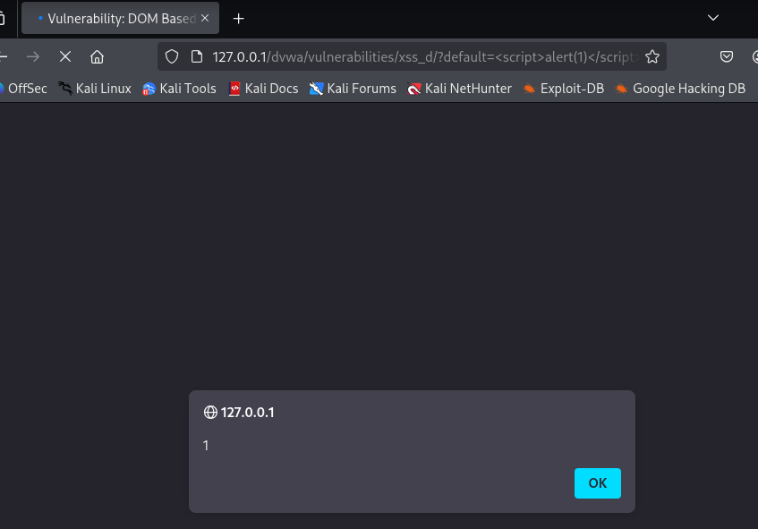
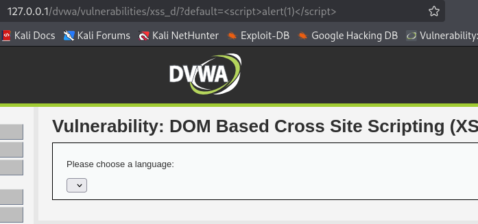

# DVWA 실습 - DOM Cross Site Scripting (XSS)

## 실습 목적
DVWA의 Low 레벨 환경에서 DOM XSS 취약점을 확인하고, 공격자가 삽입한 악성 스크립트가 프론트엔드에 그대로 실행되는 상황을 재현한다.

## 공격 시도

위 사진처럼 드랍박스로 언어를 선택하는 구조이고 선택을 누르면 

URL이 `http://127.0.0.1/dvwa/vulnerabilities/xss_d/?default=English` 로 바뀐다.

URL의 default 파라미터에 다음과 같은 XSS 페이로드를 삽입하여 공격을 시도. `` 

## 결과

url에  를 포함해 입력시 바로 위 사진처럼 alert 창이 뜨는걸 볼 수 있다. 

이는 서버가 아닌 클라이언트 쪽 자바스크립트 코드에서 DOM의 입력값을 이스케이프 처리 없이 그대로 처리했기 때문이다.

## 노트
DOM XSS는 입력값이 서버로 전송되지 않고 브라우저에서 자바스크립트를 통해 직접 반영되기 때문에 탐지가 어렵다. 

클라이언트 측에서 사용자 입력을 DOM에 삽입하기 전에 적절한 이스케이프 처리를 통해 악성 스크립트가 실행되지 않도록 해야 한다.

## 대응 코드 예시
수정된 PHP 코드 예시는 `../modified-code/XSS_DOM.php`에 있음

//💡XSS 방어 핵심 코드
  lang = lang
    .replace(/&/g, "&amp;") 
    .replace(/</g, "&lt;")
    .replace(/>/g, "&gt;")
    .replace(/"/g, "&quot;")
    .replace(/'/g, "&#x27;") 
    .replace(/\//g, "&#x2F;"); 

이러한 replace 함수로 사용자로부터 입력된 `< > " ' /` 등의 잠재적 위험 문자를 변환함으로 브라우저가 단순 텍스트로 인식하도록 했다.

## 대응 결과

위 사진처럼 를 실행해도 경고창이 나타나지 않았다. 따라서 XSS공격을 차단하였다.