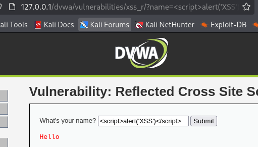
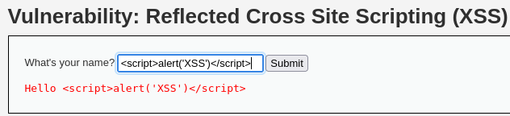

# DVWA 실습 - Reflected Cross Site Scripting (XSS)

## 실습 목적
DVWA의 Low 레벨 환경에서 Reflected XSS 취약점을 확인하고, 공격을 통해 웹 브라우저에서 악성 스크립트가 실행되는 상황을 재현한다.

## 공격 시도

페이지 주소를 통해 입력 파라미터가 name임을 확인

`?name=입력값` 사용자 입력을 그대로 HTML에 반영하므로,

입력값으로 를 시도.

## 결과
브라우저에서 alert('XSS') 경고문이 발생함.

입력값이 필터링 없이 HTML에 삽입되어 스크립트 실행되는 것을 확인.

## 노트
Reflected XSS는 사용자의 요청에 포함된 악성 스크립트가 서버 응답에 반영되어 브라우저에서 실행되는 취약점이다.

공격자는 악성 스크립트를 이용하고, 다른 사용자가 악성 링크를 클릭 또는 방문 한다면 실행시켜 쿠키 탈취가 가능하고, 세션 하이재킹을 시도할 수도 있다.

## 대응 코드 예시
수정된 PHP 코드 예시는 `../modified-code/XSS_Reflected.php`에 있음

입력값을 출력하기 전에 HTML 특수문자를 htmlspecialchars()를 이용해 이스케이프 처리.

## 대응 결과

위 사진처럼 alert를 실행해도 스크립트가 문자 그대로 출력됨.
