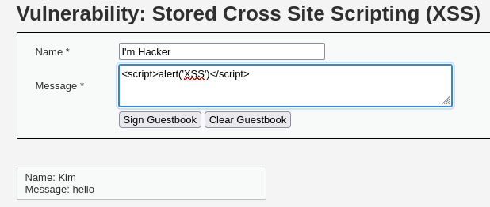
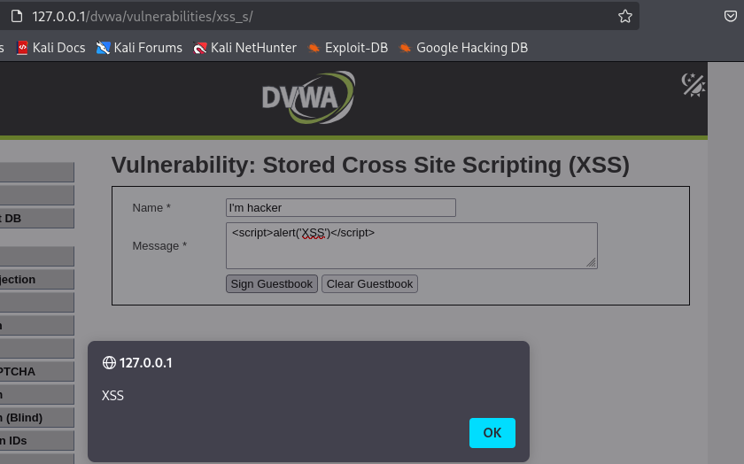
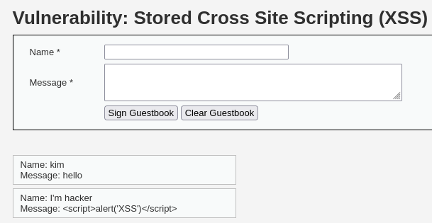

# DVWA 실습 - Stored Cross Site Scripting (XSS)

## 실습 목적
DVWA의 Low 레벨 환경에서 Stored XSS 취약점을 확인하고, 공격자가 삽입한 악성 스크립트가 서버에 저장되어, 다른 사용자가 해당 페이지를 방문할 때 자동 실행되는 상황을 재현한다.

## 공격 시도

위 사진처럼 입력 폼이 name, message가 있는 게시판 형태이며, 

입력한 값이 서버에 저장되며, 아래 목록에 출력되는 구조이다.

message 칸에 입력으로  를 시도.

## 결과

페이지를 로딩할 때마다 alert 경고문 자동 발생.

입력값이 필터링 없이 서버에 저장되어 사용자가 페이지를 방문할 때 스크립트 실행되는 것을 확인.

## 노트
Stored XSS는 공격자가 삽입한 스크립트가 서버나 db에 지속적으로 저장되어 페이지를 방문한 사람들에게 누구나 영향을 주는 취약점이다.

이 방식은 세션 쿠키 탈취 등 공격을 확장 가능하다.

## 대응 코드 예시
수정된 PHP 코드 예시는 `../modified-code/XSS_Stored.php`에 있음

XSS 대응은 보통 출력 시점에 이스케이프 처리하여 해결하는 것이 바람직하지만 이번 실습에서는 실습 구조상 입력 단계에서 처리함.

입력값을 DB에 저장하기 전에 HTML 특수문자를 htmlspecialchars()를 이용해 이스케이프 처리.

## 대응 결과

위 사진처럼 alert를 실행해도 스크립트가 문자 그대로 출력됨.

이는 입력값을 저장하기 전에 htmlspecialchars()함수로 <, > 같은 html 특수문자를 이스케이프 처리했기 때문이다. < 는 &lt;, >는 &gt;로 변환되어 저장되기 때문에, 브라우저는 일반 텍스트로 인식하게 된다.